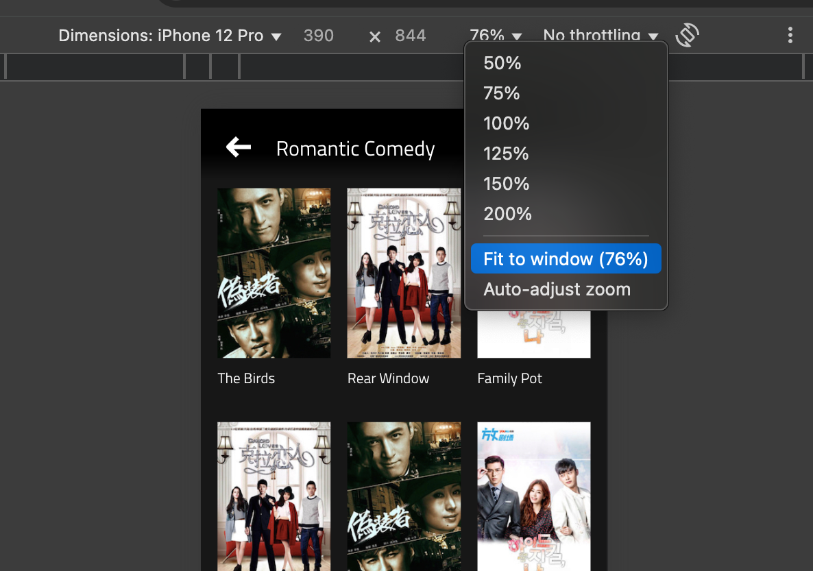
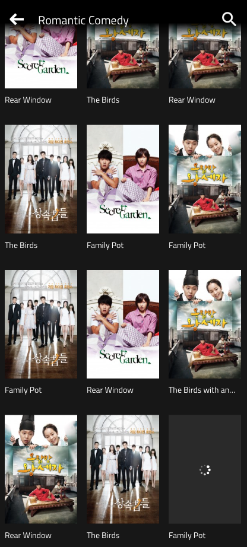

# Project

This Project you can test on this [netlify url](https://bucolic-basbousa-acb60a.netlify.app/)


# If check using Chrome developer tools, make sure to select fit to window as in below screenshot




# Project Architecture

A mobile browser version of a Content Listing page built with ReactJS, Redux toolkit, featuring lazy loading, client-side search, and responsive design as per the provided specifications.

## Features

- ✅ Pixel-perfect implementation of the provided design
- ✅ Responsive mobile portrait view with three-column grid
- ✅ Vertical scrolling with hidden scrollbars
- ✅ Lazy loading of content as user scrolls
- ✅ Client-side search functionality
- ✅ Elegant handling of edge cases
- ✅ No pausing or blocking loaders during scroll

## Tech Stack

- React.js
- Redux Toolkit for state management
- Thunk for Data fetching and management
- CSS3
- Intersection Observer API for seamless lazy loading
- Netlify for deployment

## Project Structure

```
src/
├── components/
│ ├── Header.jsx # App header with back and search buttons
│ ├── SearchBar.jsx # Search input component
│ ├── ContentGrid.jsx # Main grid layout for content items
│ ├── ContentItem.jsx # Individual content item with poster and title
│ └── Skeleton.jsx # Loading placeholder for smoother UX
│ └── FallbackContent.jsx # UI for invalid search
|  
├── hooks/
│ ├── useIntersectionObserver.js # Custom hook for lazy loading
├── Redux/
│ ├── Slices # For Managing state
│ ├── Thunks # Data fetching and management
├── App.js # Main application component
├── index.js # Entry point
└── index.css # Global styles
```

## Implementation Details

### Design Requirements

- Font: Titillium Web from Google Fonts
- Thumbnail aspect ratio: 2:3
- Background color: #171717
- Text color: #FFFFFF
- Three-column grid with even paddings
- Hidden scrollbars
- Mobile portrait view only

### Functional Features

1. **Vertical Scrolling**:
- Grid allows vertical scrolling but restricts horizontal scrolling
- Uses CSS to hide scrollbars while maintaining functionality

2. **Lazy Loading**:
- Implements Intersection Observer API for efficient detection of scroll position
- Loads next page of data when user approaches end of current content
- No visible loading indicators during scroll for seamless experience
- First page loaded on initial app load

3. **Client-Side Search**:
- Filters content based on title from already loaded data
- Updates results in real-time as user types
- Preserves UI state without page refresh

4. **Edge Case Handling**:
- Gracefully handles missing images in page 3
- Provides fallback UI for content items with errors
- Maintains consistent UI despite data irregularities


Intial View

 \

Scrolled View 
 \

# handling Page 3 items edge cases

see last item (image error) and item above on the last item (large text content)

 \

If no item matches the query, then show fallback UI
 

# Getting Started with Create React App

This project was bootstrapped with [Create React App](https://github.com/facebook/create-react-app).

## Available Scripts

In the project directory, you can run:

### `npm start`

Runs the app in the development mode.\
Open [http://localhost:3000](http://localhost:3000) to view it in your browser.

The page will reload when you make changes.\
You may also see any lint errors in the console.

### `npm test`

Launches the test runner in the interactive watch mode.\
See the section about [running tests](https://facebook.github.io/create-react-app/docs/running-tests) for more information.

### `npm run build`

Builds the app for production to the `build` folder.\
It correctly bundles React in production mode and optimizes the build for the best performance.

The build is minified and the filenames include the hashes.\
Your app is ready to be deployed!

See the section about [deployment](https://facebook.github.io/create-react-app/docs/deployment) for more information.

### `npm run eject`

**Note: this is a one-way operation. Once you `eject`, you can't go back!**

If you aren't satisfied with the build tool and configuration choices, you can `eject` at any time. This command will remove the single build dependency from your project.

Instead, it will copy all the configuration files and the transitive dependencies (webpack, Babel, ESLint, etc) right into your project so you have full control over them. All of the commands except `eject` will still work, but they will point to the copied scripts so you can tweak them. At this point you're on your own.

You don't have to ever use `eject`. The curated feature set is suitable for small and middle deployments, and you shouldn't feel obligated to use this feature. However we understand that this tool wouldn't be useful if you couldn't customize it when you are ready for it.

## Learn More

You can learn more in the [Create React App documentation](https://facebook.github.io/create-react-app/docs/getting-started).

To learn React, check out the [React documentation](https://reactjs.org/).

### Code Splitting

This section has moved here: [https://facebook.github.io/create-react-app/docs/code-splitting](https://facebook.github.io/create-react-app/docs/code-splitting)

### Analyzing the Bundle Size

This section has moved here: [https://facebook.github.io/create-react-app/docs/analyzing-the-bundle-size](https://facebook.github.io/create-react-app/docs/analyzing-the-bundle-size)

### Making a Progressive Web App

This section has moved here: [https://facebook.github.io/create-react-app/docs/making-a-progressive-web-app](https://facebook.github.io/create-react-app/docs/making-a-progressive-web-app)

### Advanced Configuration

This section has moved here: [https://facebook.github.io/create-react-app/docs/advanced-configuration](https://facebook.github.io/create-react-app/docs/advanced-configuration)

### Deployment

This section has moved here: [https://facebook.github.io/create-react-app/docs/deployment](https://facebook.github.io/create-react-app/docs/deployment)

### `npm run build` fails to minify

This section has moved here: [https://facebook.github.io/create-react-app/docs/troubleshooting#npm-run-build-fails-to-minify](https://facebook.github.io/create-react-app/docs/troubleshooting#npm-run-build-fails-to-minify)
